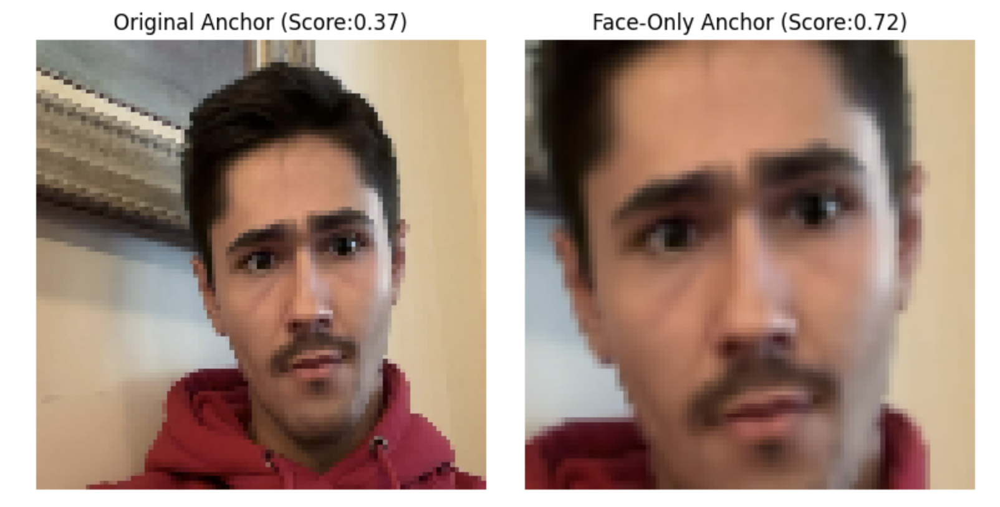
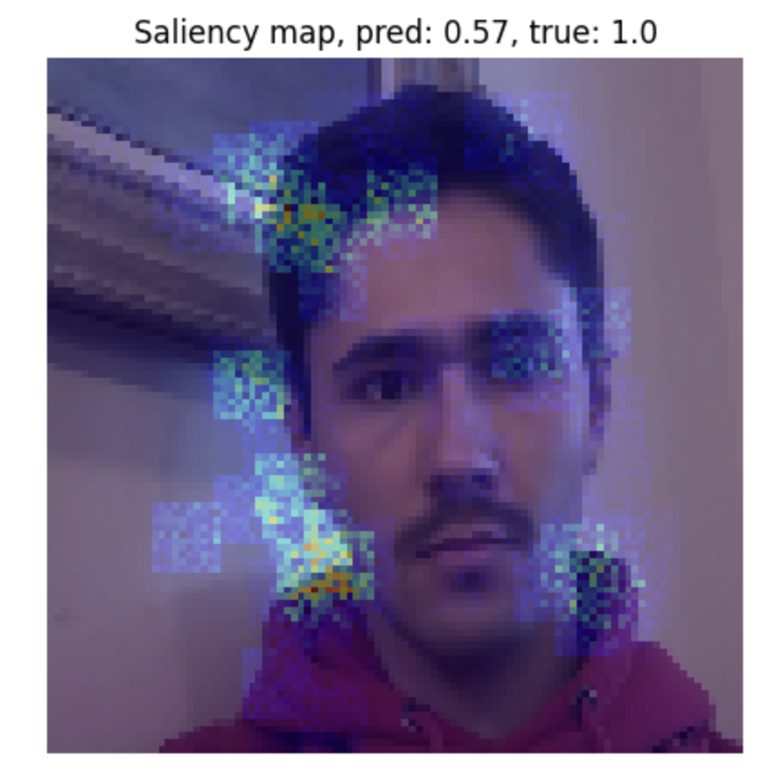

# TensorFlow Face Recognition App

This project is a robust face‐matching system that leverages a **Siamese CNN** and **OpenCV/MediaPipe** preprocessing to verify identities by comparing face embeddings. It isolates the face region to eliminate background bias and achieves high accuracy even in previously unseen environments.

Check out the full report and demo [here!](https://yourrepo.github.io/face_recognition_demo)

## 🔍 Overview
- **Collects** training data  
  - Captures **anchor + positive** images from a webcam  
  - Pulls **LFW** photos as negatives for one-shot verification  
- **Pre-processes** images with a TensorFlow **`tf.data`** pipeline  
  - Resizes to **100 × 100 px**, scales to **[0 – 1]**, then batches & prefetches  
- **Learns** compact face embeddings through a lightweight **CNN** shared by both inputs  
  - A custom **L1-distance layer** + sigmoid outputs the “same person” probability (Siamese architecture)  
- **Trains** end-to-end in Keras and checkpoints to `models/siamese_model.keras`  
- **Evaluates** on a held-out test split with `batch_eval()` for quick metrics  
- **Explains** decisions using gradient-based **saliency maps** to highlight influential pixels  
- **Verifies** faces in real time: the `verify()` loop compares the saved anchor to live webcam frames and prints match confidence  

---
## 💻 Example Usage
<sub><i>*Note: screenshots generated on custom test images.*</i></sub>

### Evaluating Cropped Face


### Saliency Map  

---
## 🔨 Roadblocks + Solutions
| Roadblock                                    | Solution                                                                                                |
|----------------------------------------------|---------------------------------------------------------------------------------------------------------|
| Inconsistent embedding focus                 | Use Grad-CAM to verify and retrain network to concentrate on central facial landmarks                    |
| High false negatives when background changes | Crop and mask out the background; train with random background augmentation                              |

<sub><i>*All “Potential additions” are plan items for future work.*</i></sub>

## Before and After Facial Cropping

## ⚙️ Features

- 👀 **Face Detection & Cropping** (OpenCV)  
- 🎭 **Background Masking** via segmentation  
- 🤝 **Siamese Embedding Comparison** with cosine similarity  
- 📈 **Threshold‐Based Identity Verification**  
- 🔍 **Grad-CAM Interpretability** tools  
- ⚙️ **Automated Benchmarks** on new environments  

---
## 🛠️ Tech Stack

| Component        | Tool                                             |
|------------------|--------------------------------------------------|
| Language         | Python                                           |
| Face Detection   | MediaPipe FaceMesh, OpenCV Haar Cascades         |
| Segmentation     | U²-Net / BiSeNet                                 |
| Embeddings       | TensorFlow, FaceNet‐style CNN                    |
| Visualization    | Matplotlib, Grad-CAM                             |
| Data Storage     | JSON                                             |

---

### 📥 Example Usage

```bash
python main.py --mode match \
  --anchor images/anchor_face.png \
  --input images/query_face.jpg \
  --threshold 0.6
